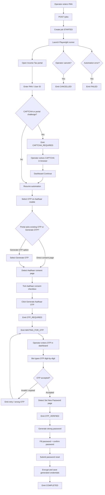
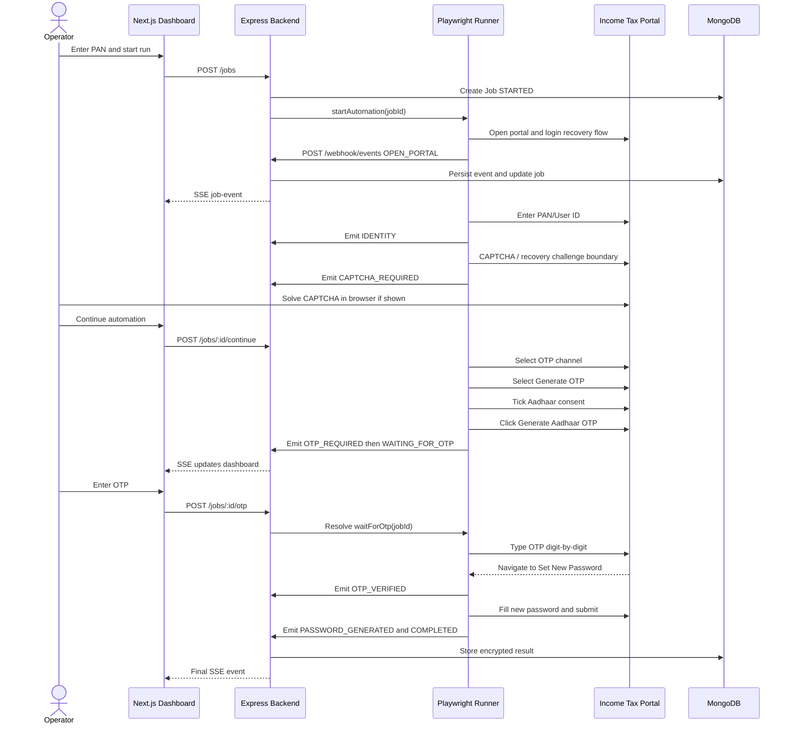
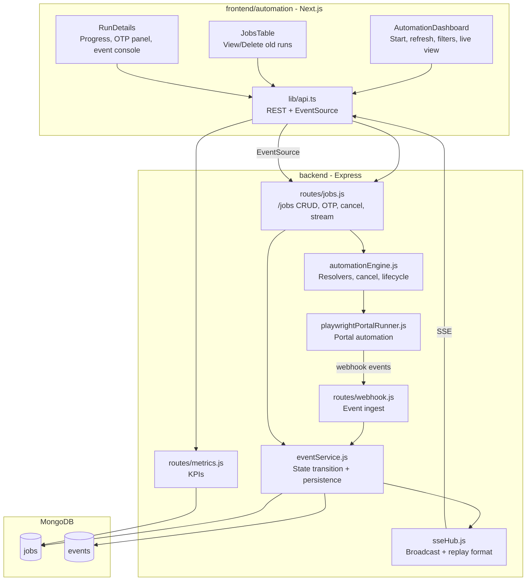
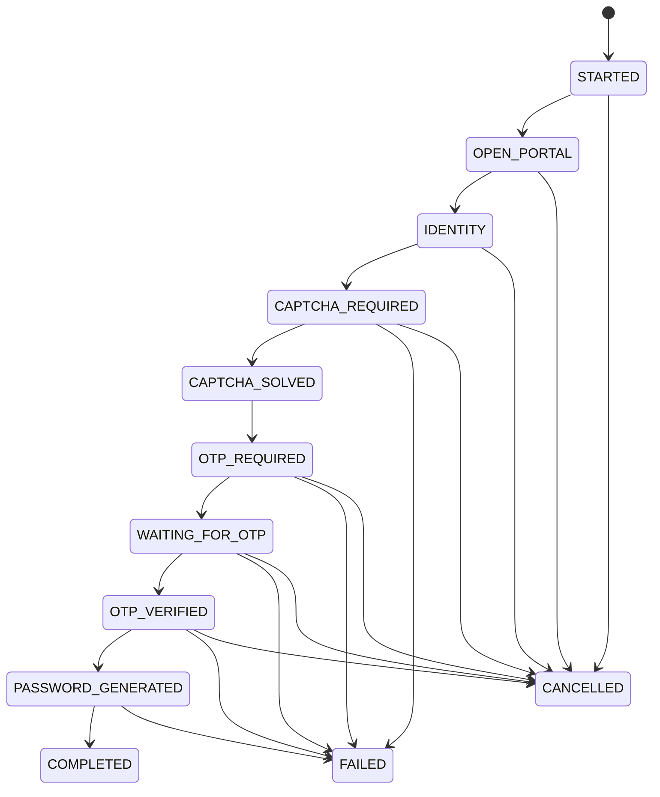
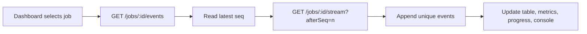

# RegisterKaro Automation Console

Operator dashboard and backend automation service for PAN-based Income Tax e-Filing password recovery.

The project demonstrates a human-in-the-loop automation flow: Playwright drives the live portal, the backend persists state/events, Server-Sent Events keep the UI live, and the operator supplies only the required OTP/CAPTCHA actions from the dashboard.

---

## Contents

- [What This System Does](#what-this-system-does)
- [High-Level Flowchart](#high-level-flowchart)
- [End-to-End Workflow](#end-to-end-workflow)
- [Architecture](#architecture)
- [State Machine](#state-machine)
- [Portal Automation Handling](#portal-automation-handling)
- [SSE Replay Design](#sse-replay-design)
- [Folder Structure](#folder-structure)
- [API Contract](#api-contract)
- [Data Model](#data-model)
- [Security](#security)
- [Local Setup](#local-setup)
- [Verification](#verification)
- [Demo Checklist](#demo-checklist)

---

## What This System Does

The system starts a password-recovery run for a PAN/User ID and tracks the full lifecycle:

1. Open Income Tax e-Filing portal.
2. Enter PAN/User ID.
3. Handle portal challenge/CAPTCHA boundary.
4. Select Aadhaar mobile OTP flow.
5. Generate Aadhaar OTP, including portal consent checkbox.
6. Pause for operator OTP input in dashboard.
7. Resume automation after OTP.
8. Detect password reset page.
9. Generate and set a strong password.
10. Persist encrypted credentials and mark run complete.

The UI also supports:

- Live runs view
- Event console
- SSE reconnect/replay
- OTP pause/resume
- CAPTCHA continue signal
- Cancel run
- Delete old terminal runs
- Dashboard refresh
- Metrics and status breakdown

---

## High-Level Flowchart

This is the simplest way to understand the complete run from operator action to completion.



---

## End-to-End Workflow



---

## Architecture



### Design Choices

- **Backend owns state:** every phase transition is validated and persisted through `eventService`.
- **Frontend is live but recoverable:** UI reads historical events first, then attaches SSE using `afterSeq`.
- **Human-in-the-loop boundaries:** CAPTCHA and OTP are intentionally operator-driven.
- **Automation is resilient to portal variation:** Playwright uses text, role, Angular Material, and DOM fallbacks.
- **Terminal cleanup:** completed/failed/cancelled runs can be deleted with their event history.

---

## State Machine



Current phases:

```text
STARTED
OPEN_PORTAL
IDENTITY
CAPTCHA_REQUIRED
CAPTCHA_SOLVED
OTP_REQUIRED
WAITING_FOR_OTP
OTP_VERIFIED
PASSWORD_GENERATED
COMPLETED
FAILED
CANCELLED
```

Status mapping:

```text
COMPLETED       -> completed
FAILED          -> failed
CANCELLED       -> cancelled
WAITING_FOR_OTP -> waiting_for_operator
all others      -> running
```

---

## Portal Automation Handling

The Playwright runner currently handles the real portal flow with several fallback paths.

### Identity

- Opens portal service/login routes.
- Finds PAN/User ID field using multiple selector strategies.
- Types PAN like a user and waits for Continue to enable.

### CAPTCHA / Challenge Boundary

- Detects CAPTCHA/security widgets.
- Emits `CAPTCHA_REQUIRED`.
- Allows operator to solve in browser.
- Dashboard sends `POST /jobs/:id/continue`.

### OTP Channel Selection

The portal can show:

```text
Select an Option to Reset Password
OTP on mobile number registered with Aadhaar
Upload Digital Signature Certificate
Use e-filing OTP
```

Runner selects Aadhaar mobile OTP using:

- text click
- label lookup
- Angular Material radio fallback
- raw `input[type="radio"]` fallback

### Generate OTP Choice

Portal may show:

```text
I already have an OTP on Mobile number registered with Aadhaar
Generate OTP
```

Runner now selects `Generate OTP`, not the existing-OTP option.

### Aadhaar Consent Page

Portal may then show:

```text
Verify, it's you
I agree to validate my Aadhaar Details
Generate Aadhaar OTP
```

Runner now:

1. Detects Aadhaar consent text.
2. Ticks checkbox with Angular-friendly click/input/change events.
3. Clicks `Generate Aadhaar OTP`.
4. Waits until actual OTP/password stage before emitting operator wait state.

### OTP Entry

Income Tax OTP fields are often six separate inputs.

Runner now:

- types digit-by-digit using keyboard events
- dispatches `input`, `change`, and `keyup`
- blurs the last field
- presses Tab
- waits for Angular validation
- avoids clicking disabled Verify/Submit buttons

If portal auto-verifies OTP and navigates directly to password page, runner detects:

```text
Set New Password
Confirm New Password
```

and emits `OTP_VERIFIED`.

### Password Reset

Runner:

- generates strong password
- fills `Set New Password`
- fills `Confirm New Password`
- dispatches Angular validation events
- waits for enabled Submit button
- marks run `PASSWORD_GENERATED`
- stores encrypted result on `COMPLETED`

---

## SSE Replay Design

The dashboard uses both event history and live SSE:



Backend stream behavior:

- `Content-Type: text/event-stream`
- `Cache-Control: no-cache, no-transform`
- `Connection: keep-alive`
- `X-Accel-Buffering: no`
- `flushHeaders()`
- heartbeat every 25 seconds
- replay via `afterSeq` or `Last-Event-ID`

The frontend de-duplicates events by `eventId`.

---

## Folder Structure

```text
Assignment_fie
├─ backend
│  ├─ package.json
│  ├─ .env
│  ├─ src
│  │  ├─ config.js
│  │  │  Loads .env and exposes PORT, MONGO_URI, auth, portal config
│  │  ├─ server.js
│  │  │  Express app, Mongo connection, routes, shutdown handling
│  │  ├─ domain
│  │  │  ├─ phases.js
│  │  │  │  Phase constants and status mapping
│  │  │  └─ stateMachine.js
│  │  │     Allowed phase transitions
│  │  ├─ middleware
│  │  │  ├─ auth.js
│  │  │  │  Bearer auth for mutating APIs
│  │  │  └─ requestContext.js
│  │  │     Request ID context
│  │  ├─ models
│  │  │  ├─ job.js
│  │  │  │  Job lifecycle, result, status, timing
│  │  │  └─ event.js
│  │  │     Append-only job event log
│  │  ├─ routes
│  │  │  ├─ jobs.js
│  │  │  │  Create/list/read/delete jobs, SSE, OTP, cancel, continue
│  │  │  ├─ webhook.js
│  │  │  │  Automation event ingestion
│  │  │  └─ metrics.js
│  │  │     KPI aggregation
│  │  ├─ services
│  │  │  ├─ automationEngine.js
│  │  │  │  Starts runner, OTP promise map, queued OTP, cancel signals
│  │  │  ├─ playwrightPortalRunner.js
│  │  │  │  Main browser automation against portal
│  │  │  ├─ eventService.js
│  │  │  │  State transition validation, DB write, SSE broadcast
│  │  │  └─ sseHub.js
│  │  │     Connected clients and SSE formatting
│  │  └─ utils
│  │     ├─ crypto.js
│  │     │  Encrypt/decrypt generated password
│  │     └─ mask.js
│  │        PAN masking helpers
│  └─ test
│     ├─ crypto.test.js
│     ├─ domain.test.js
│     └─ flow_detection.test.js
│
└─ frontend
   └─ automation
      ├─ package.json
      ├─ README.md
      ├─ app
      │  ├─ layout.tsx
      │  ├─ page.tsx
      │  └─ globals.css
      ├─ components
      │  ├─ automation-dashboard.tsx
      │  │  Main dashboard shell, tabs, actions, toasts
      │  ├─ jobs-table.tsx
      │  │  Search/filter/list/view/delete/refresh runs
      │  ├─ run-details.tsx
      │  │  Progress timeline, OTP panel, live event console
      │  ├─ metric-card.tsx
      │  ├─ status-badge.tsx
      │  └─ top-bar.tsx
      └─ lib
         ├─ api.ts
         │  REST helpers and EventSource creation
         ├─ constants.ts
         │  API base, auth token, phase list
         ├─ format.ts
         └─ types.ts
```

---

## API Contract

### Jobs

| Method | Path | Purpose |
| --- | --- | --- |
| `POST` | `/jobs` | Start a new run |
| `GET` | `/jobs` | List jobs with `search`, `phase`, `status`, `limit` |
| `GET` | `/jobs/:id` | Read one job |
| `DELETE` | `/jobs/:id` | Delete terminal run and its events |
| `GET` | `/jobs/:id/events` | Replay persisted event history |
| `GET` | `/jobs/:id/stream` | SSE stream with replay cursor |
| `POST` | `/jobs/:id/continue` | Operator confirms CAPTCHA solved |
| `POST` | `/jobs/:id/otp` | Submit operator OTP |
| `POST` | `/jobs/:id/cancel` | Cancel active run |

### Webhook

| Method | Path | Purpose |
| --- | --- | --- |
| `POST` | `/webhook/events` | Automation posts structured events |

### Metrics

| Method | Path | Purpose |
| --- | --- | --- |
| `GET` | `/metrics` | Total/completed/failed/cancelled/running/waiting and duration percentiles |

---

## Data Model

### Job

Important fields:

```text
jobId
pan                 hidden by default
maskedPan / panMasked
panHash
phase
status
lastSeq
startedAt / updatedAt / completedAt
durationMs
outcome
result.encryptedPassword
error
requestId
```

### Event

Important fields:

```text
eventId = jobId:seq
jobId
seq
phase
level
message
step
timestamp
requestId
metadata
error
```

Events are append-only and used for replay.

---

## Security

- Mutating job APIs use bearer auth via `AUTH_TOKEN`.
- Webhook event ingestion uses `X-Webhook-Secret`.
- PAN is masked in UI and logs.
- OTP/password metadata is scrubbed before storing events.
- Password is encrypted before storing in job result.
- Playwright browser closes in `finally`.
- Delete is restricted to terminal runs only.

---

## Local Setup

### Backend `.env`

Create or update `backend/.env`:

```bash
PORT=4000
SERVICE_BASE_URL=http://localhost:4000
MONGO_URI=mongodb://127.0.0.1:27017/registerkaro_itr
AUTH_TOKEN=change-me
WEBHOOK_SECRET=change-me-too
PORTAL_URL=https://www.incometax.gov.in/iec/foportal/
PLAYWRIGHT_HEADLESS=false
```

### Frontend `.env`

Create or update `frontend/automation/.env`:

```bash
NEXT_PUBLIC_API_BASE_URL=http://localhost:4000
NEXT_PUBLIC_AUTH_TOKEN=change-me
```

### Install

From project root:

```bash
npm install --prefix backend
npm install --prefix frontend/automation
```

### Run

Terminal 1:

```bash
npm run dev --prefix backend
```

Terminal 2:

```bash
npm run dev --prefix frontend/automation
```

Open:

- UI: http://localhost:3000
- Backend health: http://localhost:4000/health

---

## Verification

Backend:

```bash
npm test --prefix backend
node --check backend/src/services/playwrightPortalRunner.js
node --check backend/src/routes/jobs.js
node --check backend/src/routes/metrics.js
```

Frontend:

```bash
npm run lint --prefix frontend/automation
npm run build --prefix frontend/automation
```

Latest verified checks during development:

```text
backend tests: 10/10 passing
frontend eslint: passing
frontend build: passing
```

---

## Demo Checklist

1. Start MongoDB and backend.
2. Start frontend.
3. Open dashboard.
4. Start run with valid PAN.
5. Watch live events stream.
6. If CAPTCHA appears, solve it in Playwright browser and click Continue in dashboard.
7. Confirm bot selects OTP channel and Generate OTP.
8. Confirm bot ticks Aadhaar consent and clicks Generate Aadhaar OTP.
9. Enter OTP in dashboard.
10. Confirm bot detects password reset page.
11. Confirm password is generated and submitted.
12. Confirm run becomes `COMPLETED`.
13. Confirm metrics update.
14. Cancel a live run and confirm table/status/metrics update.
15. Delete a terminal run and confirm event history is removed.

---

## Notes for Reviewers

This project intentionally keeps OTP human-in-the-loop. The automation does not read SMS/email OTPs. Instead, it pauses at `WAITING_FOR_OTP`, stores a resolver in memory, accepts operator OTP from the dashboard, then resumes the Playwright flow.

The implementation also includes a race fix: if the operator submits OTP just before the resolver is registered, the backend queues the OTP and `waitForOtp()` consumes it immediately.
